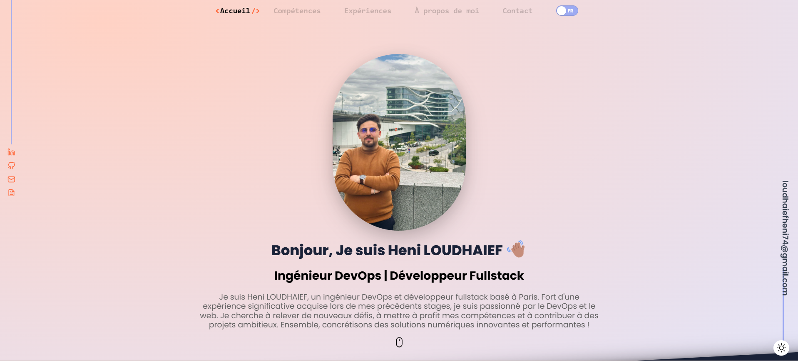

# Portfolio Website

A modern and responsive portfolio website built with **React**, **Tailwind CSS**, and **TypeScript**.  
This project showcases my skills and projects as a full-stack developer. The contact form functionality is powered by a backend developed using **Node.js** and **Express**.



---

## 🌟 Features

- **SEO Optimized**: Ensures better visibility and search engine ranking.
- **Session-Based User Settings**: User preferences (like theme) are saved in session storage.
- **Dark & Light Mode**: Theme switching for an enhanced user experience.
- **Easy Content Management**: Modify all website content from a single `data.tsx` file.
- **Optimized Performance**: Gzipped assets and lazy-loaded components for faster performance.
- **Responsive Design**: Built with a **Mobile-First** approach, fully responsive across all devices.
- **Smooth Animations**: Engaging scrolling animations using **GSAP** and **Framer Motion**.
- **Uptime Monitoring**: Includes service monitoring with visual status indicators.

---

## 🚀 Installation

Follow these steps to set up the project locally:

1. **Clone the repository**

   ```bash
   git clone <repository-url>
   ```

2. **Navigate to the project folder**

   ```bash
   cd portfolio-website
   ```

3. **Install dependencies**

   ```bash
   npm install
   ```

4. **Start the development server**
   ```bash
   npm run dev
   ```

---

## 🛠 Environment Variables

To run this project, you need to create a `.env` file in the root directory.  
Refer to the `.env-init` file for the structure and define the following variables:

- `API_BASE_URL`: Base URL for backend API.
- `API_SERVICESTATUS_URL`: URL for uptime monitoring service.

---

## 📦 Tech Stack

### **Frontend**

- React, React Router DOM
- Tailwind CSS, TypeScript
- Axios, Framer Motion
- GSAP, Prism React Renderer
- Swiper, Rollup Plugin Gzip

### **Backend**

- Node.js
- Express.js
- NodeMailer

---

## 📋 Folder Structure

```
portfolio-website/
├── src/
│   ├── components/    # Reusable React components
│   ├── assets/        # Images, icons, and static files
│   ├── styles/        # Tailwind CSS configurations and global styles
│   ├── utils/         # Helper functions and utilities
│   └── data.tsx       # Portfolio content
├── server/            # Node.js backend for the contact form
├── .env               # Environment variables
└── README.md          # Project documentation
```

---

## 🤝 Support

If you find this project helpful or inspiring, please give it a ⭐ on GitHub.  
Your support is greatly appreciated! 😊
